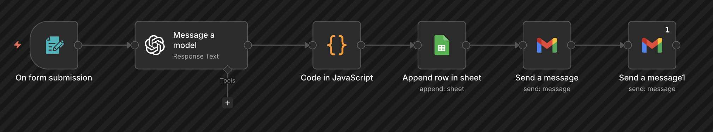
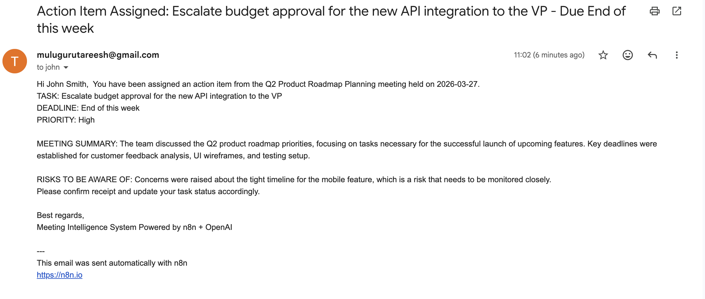
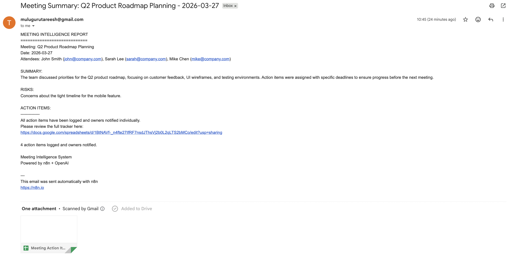
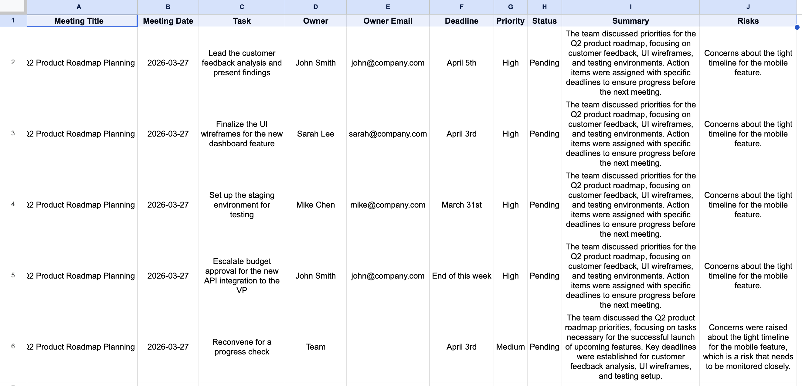

# Meeting Intelligence System

An AI-powered n8n workflow that transforms raw meeting notes into 
structured action items, automatically notifies each owner, and 
sends a manager summary — all triggered by a simple web form.

## Live Demo
Submit meeting notes here: [Form Link](https://tareesh.app.n8n.cloud/form-test/db610d0a-dd15-46b8-932f-e3b30a2ef444)

## Business Problem
After every meeting, BAs and project managers spend 30-45 minutes 
manually writing up action items, emailing owners, and updating 
trackers. This workflow eliminates all of that — saving an estimated 
45 minutes per meeting, or 15+ hours per month for active teams.

## Workflow Architecture

Form Submission (meeting notes)
→ OpenAI GPT-4o-mini (extracts tasks, owners, deadlines, priorities, risks)
→ IF node (validates OpenAI response before parsing)
→ JavaScript Code (parses JSON, splits into individual action items)
→ IF node (validates action items were extracted)
→ Google Sheets (logs all action items with status tracking)
→ Gmail x4 (sends personalized email to each action item owner)
→ Gmail x1 (sends full summary report to manager)

## Error Handling
- Dedicated Error Workflow catches any node failure automatically
- IF node validates OpenAI response before the Code node parses it
- IF node validates action items were extracted before logging
- Filter skips action items with missing owner emails
- Gmail node set to continue on error — one bad email won't stop the workflow
- Alert email sent to admin with failure details and troubleshooting steps

## Sample Output

### Personalized Owner Email

### Manager Summary Email

### Action Items Tracker

## Tools & Technologies
- n8n (workflow automation)
- OpenAI GPT-4o-mini (AI extraction and analysis)
- Google Sheets (action item tracking)
- Gmail API (personalized email delivery)

## BA Deliverables
- Business requirement: eliminate manual post-meeting admin
- Stakeholders: BAs, Project Managers, Team Leads
- ROI: 45 min saved per meeting = 15+ hours per month
- Risk tracking: AI identifies and flags meeting risks automatically
- Error handling: automated failure detection and admin alerts

## Known Limitations & Future Improvements
- Owner email must be included in meeting notes for auto-notification
- Currently handles English language meeting notes only
- Looker Studio dashboard for task completion tracking planned
- Slack notification integration planned as alternative to email

## How to Run
1. Import workflow.json into your n8n instance
2. Add credentials: OpenAI API key, Gmail OAuth, Google Sheets OAuth
3. Create a Google Sheet with columns: Meeting Title, Meeting Date,
   Task, Owner, Owner Email, Deadline, Priority, Status, Summary, Risks
4. Set up the Error Handler workflow and link it in settings
5. Update the manager email address in the summary Gmail node
6. Publish the workflow and share the form URL with your team

## Author
Tareesh Muluguru — Business Analyst
[LinkedIn](https://linkedin.com/in/tareesh-m) |
[Email](mailto:mulugurutareesh@gmail.com)
